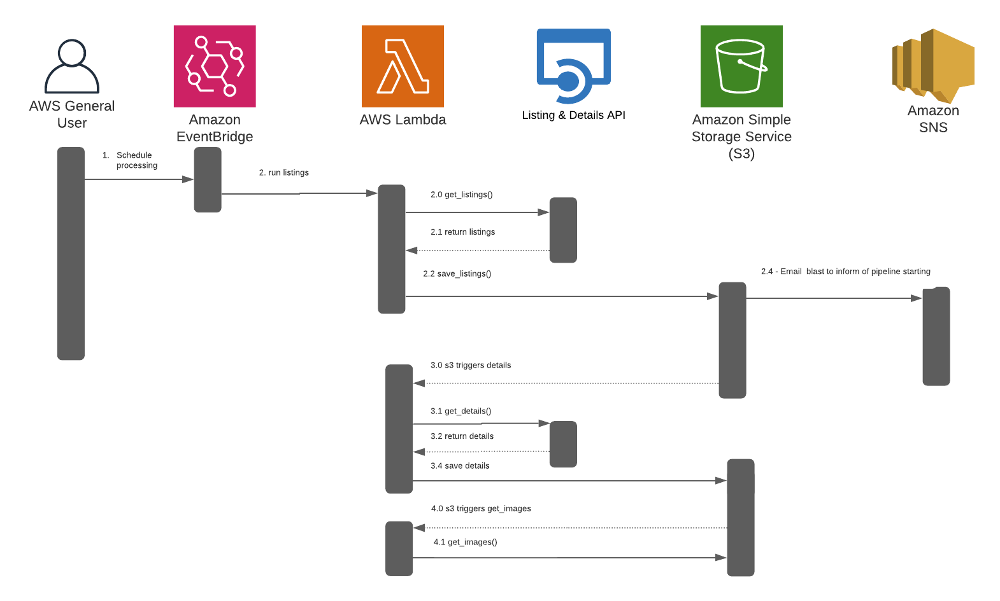
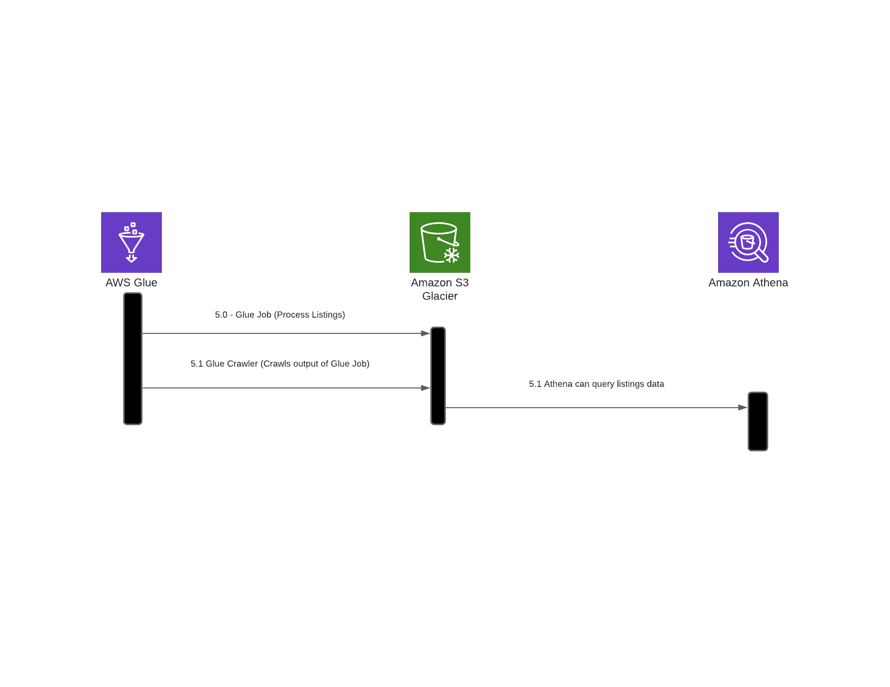

# propertybot-data-engineering


## Table of Contents
---

* [Data Sources](#Data-Sources)
    * [Properties for Sale](#Properties-for-Sale)
    * [Property Details](#Property-Details)
* [Data Pipeline](#Data-Pipeline)
    * [Data Collection & Enrichment](#Data-Collection-&-Enrichment)
    * [Data Processing with Glue & Querying with Athena](#Data-Processing-with-Glue-&-Querying-with-Athena)

   


## Data Sources
---

## Properties for Sale

**Source: [Realty in US through RapidAPI.com](https://rapidapi.com/apidojo/api/realty-in-us/)**


### Example API Call

```python
import requests

url = "https://realty-in-us.p.rapidapi.com/properties/v2/list-for-sale"

querystring = {"city":"New York City","state_code":"NY","offset":"0","limit":"200","sort":"relevance"}

headers = {
    'x-rapidapi-host': "realty-in-us.p.rapidapi.com",
    'x-rapidapi-key': YOUR_KEY_HERE
    }

response = requests.request("GET", url, headers=headers, params=querystring)

print(response.text)

```

### Parameters - Required

| parameter | format  | example | description |
| :--- | :--- | :--- | :--- |
| `city` | string | "New York City" | The value of city field responded in locations/auto-complete API (do not use this parameter with postal_code| 
| `state_code` | string | "NY" | The value of state_code field responded in locations/auto-complete API (do not use this parameter with postal_code | 
| `offset` | number | 0 | The offset of items to be ignored in response for paging | 
| `limit` | number | 200 | The number of items to be responded in every request | 


### Parameters - Optional

| parameter | format  | example | description |
| :--- | :--- | :--- | :--- |
| `postal_code` | STRING | "90094"| Zip code or postal code (do not use this parameter with city and state_code | 
| `sort` | STRING | "newest"| One of the followings, separated by comma for multiple values: relevance, newest, price_low, price_high, photos, open_house_date, sqft_high, price_reduced_date| 
| `prop_type` | STRING | "single_family"| One of the followings (separated by comma for multiple values): single_family, multi_family, condo, mobile, land, farm, other| 
| `prop_sub_type` | STRING | "condo"| One of the followings (separated by comma for multiple values): condo, cond_op, townhouse, co_op| 
| `features` | STRING | "hardwood_floors"| One of the followings (separated by comma for multiple values): garage_2_or_more, view, waterfront, golf_course_view, swimming_pool, cul_de_sac, hardwood_floors, basement, fireplace, energy_efficient, disability_features, dining_room, washer_dryer, family_room, den_or_office, game_room,central_air, central_heat, forced_air, single_story, two_or_more_stories, corner_lot,water_view, golf_course_lot_or_frontage, hill_or_mountain_view, ocean_view, city_view, lake_view, river_view, community_security_features, community_swimming_pool, community_boat_facilities, recreation_facilities, community_clubhouse, community_horse_facilities, community_tennis_court, community_park, community_golf, senior_community, community_spa_or_hot_tub, rv_or_boat_parking, horse_facilities, tennis_court, spa_or_hot_tub, garage_1_or_more, garage_3_or_more,carport|
| `radius` | NUMBER | 2| Radius in miles to look for properties (1 to 20)|
| `age_min` | NUMBER | 10| Min age of properties|
| `age_max` | NUMBER | 50| Max age of properties|
| `sqft_min` | NUMBER | 800| Min size of the properties|
| `sqft_max` | NUMBER | 2500| Max size of the properties|
| `beds_min` | NUMBER | 1| Min baths of properties|
| `beds_max` | NUMBER | 4| Max baths of properties|
| `price_min` | NUMBER | 100000| Option filter by setting min price
| `price_max` | NUMBER | 250000| Option filter by setting max price|
| `lot_sqft_min` | NUMBER | 1| Min Lot/Acreage size|
| `lot_sqft_max` | NUMBER | 3| Max Lot/Acreage size|
| `is_matterports` | BOOLEAN | false| true/false - 3D tours only|
| `is_foreclosure` | BOOLEAN | false| true/false - Foreclosures only|
| `has_open_house` | BOOLEAN | false| true/false - Open houses only|
| `is_new_construction` | BOOLEAN | false| true/false - New construction only|
| `is_contingent` | BOOLEAN | false| true/false - Contingent only|
| `is_pending` | BOOLEAN | false| true/false - Pending only|
| `is_new_plan` | BOOLEAN | false| true/false - Homes not yet built|
| `lat_max` | NUMBER | 36.778259| Look for properties in bounding box, this is the max latitude of the coordinate. Has no affect if postal_code, or city or state_code parameter has value.|
| `lat_min` | NUMBER | 36.778259| Look for properties in bounding box, this is the min latitude of the coordinate. Has no affect if postal_code, or city or state_code parameter has value.|
| `lng_max` | NUMBER | 36.778259| Look for properties in bounding box, this is the max longitude of the coordinate. Has no affect if postal_code, or city or state_code parameter has value.|
| `lng_min` | NUMBER | 36.778259| Look for properties in bounding box, this is the min longitude of the coordinate. Has no affect if postal_code, or city or state_code parameter has value.|


## Property Details

**Source: [Realty in US through RapidAPI.com](https://rapidapi.com/apidojo/api/realty-in-us/)**


### Example API Call

```Python
import requests

url = "https://realty-in-us.p.rapidapi.com/properties/v2/detail"

querystring = {"property_id":"O3599084026"}

headers = {
    'x-rapidapi-host': "realty-in-us.p.rapidapi.com",
    'x-rapidapi-key': YOUR_KEY_HERE
    }

response = requests.request("GET", url, headers=headers, params=querystring)

print(response.text)

```

### Parameters - Required
| parameter | format  | example | description |
| :--- | :--- | :--- | :--- |
| `property_id` | string | "O3599084026" | The value of property_id field returned in …/properties/list-…. or …/properties/v2/list-… endpoints.| 


### Parameters - Optional
**None**


## Data Pipeline
---

### Data Collection & Enrichment




This process is triggered daily at 1130am PST.

* 1.0 - Eventbridge starts model Lambdas: 
    * start-model-room-classifier
    * start-kitchen-classifier
    * start-bathroom-classifier
* 2.0 - 30 minutes later Eventbridge starts data collection by triggering - Lambda: get-listings
    * 2.1 Data saved to S3: pb-get-listings
* 3.0 - S3 triggers the rest of the lambdas to collect and enrich the data in sequence & record by record: 
    * 3.1 Lambda - get-details
        * 3.11 - Data saved to s3: pb-get-details
    * 3.2 Lambda - get-images
        * 3.21 Data saved to s3: pb-images-raw
        * 3.22 Data saved to s3: pb-details-enriched
    * 3.3 Lambda - run-model-room-classifier
        * 3.31 Data saved to s3: 
            * pb-images-attict
            * pb-images-back-yard
            * pb-images-basement
            * pb-images-bathroom
            * pb-images-bedroom
            * pb-images-dining-room
            * pb-images-front-yard
            * pb-images-garage
            * pb-images-kitchen
            * pb-images-living-room
            * pb-images-closet-storage
            
     * 3.4 Run room-level classifiers
         * run-model-kitchen
         * run-model-bathroom
         * JSON labelels saved in s3: pb-images-labeled
         
* 4.0 - 1 hour after pipeline, EventBridge stops all model Lambdas
    * stop-model-room-classifier
    * stop-kitchen-classifier
    * stop-bathroom-classifier

### Data Processing with Glue & Querying with Athena

NOTE: the image above is the sequence diagram for processing listings, but the same process applies to processing the Details and the Image data as described below.


* 5.0 Processing Listings
    * 5.1 AWS Glue DataBrew Job: pb-clean-listings
        * xxxxx
        * Compressed and columnar data are saved in s3: pb-clean-listings

    * 5.2 Glue Crawler runs and creates table in Athena for analyzing pb-clean-listings: 
        * Glue Crawler:pb-clean-listings
        * Athena Table: pb-clean-listings

* 6.0 Processing Details
    * 5.1 AWS Glue DataBrew Job: pb-clean-details
        * xxxxx
        * Compressed and columnar data are saved in s3: pb-clean-details

    * 5.2 Glue Crawler runs and creates table in Athena for analyzing pb-clean-details: 
        * Glue Crawler: pb-clean-details
        * Athena Table: pb-clean-details


* 7.0.0 Processing Image Labels
    * 7.1 AWS Glue DataBrew Job: pb-clean-image-labels
        * Takes json files for image data and runs recipe to flatten the structs/arrays into columnar data
        * Compressed and columnar data are saved in s3: pb-clean-image-labels

    * 7.2 Glue Crawler runs and creates table in Athena for analyzing image labels: 
        * Glue Crawler: pb-clean-image-labels
        * Athena Table: pb-clean-image-labels


