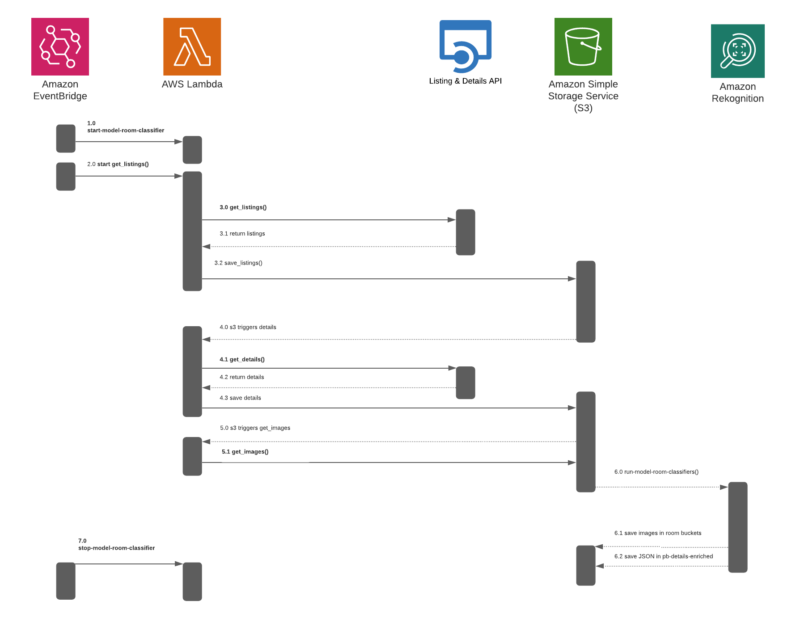

# propertybot-data-engineering


## Table of Contents
---

* [Data Sources](#Data-Sources)
    * [Properties for Sale](#Properties-for-Sale)
    * [Property Details](#Property-Details)
* [Data Pipeline](#Data-Pipeline)
    * [Data Collection & Enrichment](#Data-Collection-&-Enrichment)
    * [Data Processing & Updating](#Data-Processing-&-Updating)
   


## Data Sources
---

## Properties for Sale

**Source: [Realty in US through RapidAPI.com](https://rapidapi.com/apidojo/api/realty-in-us/)**


### Example API Call

```python
import requests

url = "https://realty-in-us.p.rapidapi.com/properties/v2/list-for-sale"

querystring = {"city":"New York City","state_code":"NY","offset":"0","limit":"200","sort":"relevance"}

headers = {
    'x-rapidapi-host': "realty-in-us.p.rapidapi.com",
    'x-rapidapi-key': YOUR_KEY_HERE
    }

response = requests.request("GET", url, headers=headers, params=querystring)

print(response.text)

```

### Parameters - Required

| parameter | format  | example | description |
| :--- | :--- | :--- | :--- |
| `city` | string | "New York City" | The value of city field responded in locations/auto-complete API (do not use this parameter with postal_code| 
| `state_code` | string | "NY" | The value of state_code field responded in locations/auto-complete API (do not use this parameter with postal_code | 
| `offset` | number | 0 | The offset of items to be ignored in response for paging | 
| `limit` | number | 200 | The number of items to be responded in every request | 


### Parameters - Optional

| parameter | format  | example | description |
| :--- | :--- | :--- | :--- |
| `postal_code` | STRING | "90094"| Zip code or postal code (do not use this parameter with city and state_code | 
| `sort` | STRING | "newest"| One of the followings, separated by comma for multiple values: relevance, newest, price_low, price_high, photos, open_house_date, sqft_high, price_reduced_date| 
| `prop_type` | STRING | "single_family"| One of the followings (separated by comma for multiple values): single_family, multi_family, condo, mobile, land, farm, other| 
| `prop_sub_type` | STRING | "condo"| One of the followings (separated by comma for multiple values): condo, cond_op, townhouse, co_op| 
| `features` | STRING | "hardwood_floors"| One of the followings (separated by comma for multiple values): garage_2_or_more, view, waterfront, golf_course_view, swimming_pool, cul_de_sac, hardwood_floors, basement, fireplace, energy_efficient, disability_features, dining_room, washer_dryer, family_room, den_or_office, game_room,central_air, central_heat, forced_air, single_story, two_or_more_stories, corner_lot,water_view, golf_course_lot_or_frontage, hill_or_mountain_view, ocean_view, city_view, lake_view, river_view, community_security_features, community_swimming_pool, community_boat_facilities, recreation_facilities, community_clubhouse, community_horse_facilities, community_tennis_court, community_park, community_golf, senior_community, community_spa_or_hot_tub, rv_or_boat_parking, horse_facilities, tennis_court, spa_or_hot_tub, garage_1_or_more, garage_3_or_more,carport|
| `radius` | NUMBER | 2| Radius in miles to look for properties (1 to 20)|
| `age_min` | NUMBER | 10| Min age of properties|
| `age_max` | NUMBER | 50| Max age of properties|
| `sqft_min` | NUMBER | 800| Min size of the properties|
| `sqft_max` | NUMBER | 2500| Max size of the properties|
| `beds_min` | NUMBER | 1| Min baths of properties|
| `beds_max` | NUMBER | 4| Max baths of properties|
| `price_min` | NUMBER | 100000| Option filter by setting min price
| `price_max` | NUMBER | 250000| Option filter by setting max price|
| `lot_sqft_min` | NUMBER | 1| Min Lot/Acreage size|
| `lot_sqft_max` | NUMBER | 3| Max Lot/Acreage size|
| `is_matterports` | BOOLEAN | false| true/false - 3D tours only|
| `is_foreclosure` | BOOLEAN | false| true/false - Foreclosures only|
| `has_open_house` | BOOLEAN | false| true/false - Open houses only|
| `is_new_construction` | BOOLEAN | false| true/false - New construction only|
| `is_contingent` | BOOLEAN | false| true/false - Contingent only|
| `is_pending` | BOOLEAN | false| true/false - Pending only|
| `is_new_plan` | BOOLEAN | false| true/false - Homes not yet built|
| `lat_max` | NUMBER | 36.778259| Look for properties in bounding box, this is the max latitude of the coordinate. Has no affect if postal_code, or city or state_code parameter has value.|
| `lat_min` | NUMBER | 36.778259| Look for properties in bounding box, this is the min latitude of the coordinate. Has no affect if postal_code, or city or state_code parameter has value.|
| `lng_max` | NUMBER | 36.778259| Look for properties in bounding box, this is the max longitude of the coordinate. Has no affect if postal_code, or city or state_code parameter has value.|
| `lng_min` | NUMBER | 36.778259| Look for properties in bounding box, this is the min longitude of the coordinate. Has no affect if postal_code, or city or state_code parameter has value.|


### Example Record
```JSON
{
    "property_id":"M4686649930",
    "listing_id":"2938275841",
    "products":[
        "0":"core.agent",
        "1":"core.broker",
        "2":"co_broke"
    ],
    "rdc_web_url":"https://www.realtor.com/realestateandhomes-detail/4010-Sea-Gate-Ave_Brooklyn_NY_11224_M46866-49930",
    "prop_type":"multi_family",
        "address":{
            "city":"Brooklyn",
            "line":"4010 Sea Gate Ave",
            "postal_code":"11224",
            "state_code":"NY",
            "state":"New York",
            "county":"Kings",
            "fips_code":"36047",
            "county_needed_for_uniq":false,
            "lat":40.576996,
            "lon":-74.005901,
            "neighborhood_name":"Sea Gate",
        },
        "branding":{
            "listing_office":{
                "list_item":{
                    "name":"TALK OF THE TOWN REALTY C",
                    "photo":null,
                    "phone":null,
                    "slogan":null,
                    "show_realtor_logo":false,
                    "link":null,
                    "accent_color":null
                    }
                }
            },
        "prop_status":"for_sale"
        "price":699000,
        "baths_full":3,
        "baths":3,
        "beds":4,
        "building_size":{
            "size":2100,
            "units":"sqft"
        }
        "agents":[
            "0":{
                "primary":true,
                "advertiser_id":"3127779",
                "id":"3127779",
                "photo":{
                    "href":"https://ap.rdcpix.com/218039382/c51349092b07f1144c8eaeb557d2aae0a-c0od-r7_w110.jpg"
                },
                "name":"Keren Shalmoni"
            }
        "office":{
            "id":"5095270e4ad1e96f1bf5bc2f2cf61615",
            "name":"TALK OF THE TOWN REALTY C",
        },
        "last_update":"2021-12-20T13:07:14Z",
        "client_display_flags":{
            "presentation_status":"for_sale,
            "is_showcase":false,
            "lead_form_phone_required":true,
            "price_change":0,
            "is_co_broke_email":true,
            "has_open_house":false,
            "is_co_broke_phone":false,
            "is_new_listing":true,
            "is_new_plan":false,
            "is_turbo":false,
            "is_office_standard_listing":false,
            "suppress_map_pin":false,
            "show_contact_a_lender_in_lead_form":false,
            "show_veterans_united_in_lead_form":false,
            "flip_the_market_enabled":true,
            "is_showcase_choice_enabled":false,
            }
        "lead_forms":{
            "form":{
                "name":{
                    "required":true,
                    "minimum_character_count":1
                },
                "email":{
                    "required":true,
                    "minimum_character_count":5
                },
                "phone":{
                    "required":true,
                    "minimum_character_count":10,
                    "maximum_character_count":11
                },
                "message":{
                    "required":false,
                    "minimum_character_count":0
                },
                "show":true
                }
            "show_agent":false,
            "show_broker":false,
            "show_builder":false,
            "show_contact_a_lender":false,
            "show_veterans_united":false,
            "form_type":"classic",
            "lead_type":"co_broke",
            "is_lcm_enabled":false,
            "flip_the_market_enabled":true,
            "local_phone":"(888)860-0947",
            "local_phones":{
            "comm_console_mweb":"(888)860-0947",
            }
            "show_text_leads":true,
            "cashback_enabled":true,
            "smarthome_enabled":false,
            }
            "photo_count":2,
            "thumbnail":"https://ap.rdcpix.com/203596091bc86c4dcbd807d80f800b65l-m4265838673x.jpg",
            "page_no":1,
            "rank":1,
            "list_tracking":"BUNCH OF STUFF"
                    "lot_size":{
                        "size":3000,
                        "units":"sqft",
                    },
                    "mls":{
                        "name":"Brooklyn",
                        "id":"457881",
                        "plan_id":NULL,
                        "abbreviation":"BONY",
                        "type":"mls",
                    },
                    "data_source_name":"mls",
                    }


```


## Property Details

**Source: [Realty in US through RapidAPI.com](https://rapidapi.com/apidojo/api/realty-in-us/)**


### Example API Call

```Python
import requests

url = "https://realty-in-us.p.rapidapi.com/properties/v2/detail"

querystring = {"property_id":"O3599084026"}

headers = {
    'x-rapidapi-host': "realty-in-us.p.rapidapi.com",
    'x-rapidapi-key': YOUR_KEY_HERE
    }

response = requests.request("GET", url, headers=headers, params=querystring)

print(response.text)

```

### Parameters - Required
| parameter | format  | example | description |
| :--- | :--- | :--- | :--- |
| `property_id` | string | "O3599084026" | The value of property_id field returned in …/properties/list-…. or …/properties/v2/list-… endpoints.| 


### Parameters - Optional
**None**

### Example Record
```JSON
{
    "property_id":"O3599084026",
    "prop_status":"not_for_sale",
    "prop_type":"single_family",
    "suppression_flags":[
        0:"suppress_foreclosure",
        ],
    "buyer_agent_for_far":{
    "advertiser_id":2821876,
        "name":"Non Member",
        "nrds_verified_id":NULL,
        "state_license":NULL,
        "mls_membership":{
            "member":{
                "id":"NM0000",
                "agent_system_id":"NM0000",
                "name":NULL,
                "abbreviation":"BONY",
            }
        }
    },
    
    "broker":{
        "name":"Weichert Realtors The Franzese Group",
            "phone1":{
            "number":"7182321004",
            "type":"broker",
            }
        }
    "year_built":1930,
    "beds":2,
    "description":"429 Beach 145th St, Rockaway Park, NY 11694 is a single family home built in 1930. This property was last sold for 705,000 in 2019 and currently has an estimated value of 819,900. According to the Rockaway Park public records, the property at 429 Beach 145th St, Rockaway Park, NY 11694 has approximately 1200 square feet, 2 beds and 1 baths with a lot size of 4,000 square feet. Nearby schools include Ps Ms 114 Belle Harbor. "
    "baths_full":1,
    "stories":1,
    "schools":[
        "0":{
            "nces_id":"360012302426",
            "id":"0751462661",
            "greatschools_id":"3602388",
            "name":"Ps Ms 114 Belle Harbor",
            "education_levels":[
                "0":"elementary",
                "1":"middle"
            ],
            "funding_type":"public",
            "lat":40.577746,
            "lon":-73.854382,
            "student_count":669,
            "student_teacher_ratio":13.2,
            "location":{
                "city_slug_id":"Queens_NY",
                "postal_code":"11694",
                "state":"NY",
                "county":"Queens",
                "city":"Queens",
                "street":"134-1 Cronston Avenue"
            },
            "phone":"(718) 634-3382",
            "distance_in_miles":0.5,
            "grades":{
                "range":{
                    "low":"PK",
                    "high":"8"
                }
            },
            "relevance":"assigned",
            "ratings":{
                "great_schools_rating":8,
                "parent_rating":3
            }
        }],
    "heating":NULL,
    "cooling":NULL,
    "address":{
        "city":"Rockaway Park",
        "line":"429 Beach 145th St",
        "unit_value":NULL,
        "street_direction":NULL,
        "street_post_direction":NULL,
        "postal_code":"11694",
        "address_validation_code":"121",
        "state_code":"NY",
        "state":"New York",
        "county":"Queens",
        "county_needed_for_uniq":false,
        "time_zone":"America/New_York",
        "lat":40.574091,
        "lon":-73.862966,
        "neighborhood_name":"Neponsit",
            "neighborhoods":[
                0:{
                "name":"Neponsit",
                "city":"Queens",
                "state_code":"NY",
                "level":"sub_neighborhood",
                "id":"885",
                },]
        },
    "client_display_flags":{
        "presentation_status":"not_for_sale"
        },
    "tax_history":[
        0:{
            "assessment":{
            "building":34440,
            "land":12780,
            "total":47220,
            }
            ,
            "market":{
            "building":574000,
            "land":213000,
            "total":787000,
            },
            "tax":6894,
            "year":2021,
        }],
    "sold_history":[
        0:{
        "date":"2019-12-13T17:00:00Z",
        "source":"MLS #427356",
        "listing":{
        "price":705000,
        },

        },
        "property_history":[
            0:{
            "event_name":"Sold",
            "date":"2019-12-13T17:00:00Z",
            "price":705000,
            "price_range_min":NULL,
            "price_range_max":NULL,
            "price_changed":-34000,
            "sqft":1200,
            "datasource_name":"Brooklyn",
            "source":"MLS #427356",
            "listing":{...}12 items,
            "iso_date":"2019-12-13",
            "previous_event_price":739000,
            },],
        "public_records":[
            0:{
            "prop_type":"single_family",
            "baths":NULL,
            "baths_half":NULL,
            "baths_full":NULL,
            "baths_3qtr":NULL,
            "baths_1qtr":NULL,
            "beds":NULL,
            "distinct_baths":NULL,
            "sqft":0,
            "building_sqft":NULL,
            "floor_1_sqft":NULL,
            "fireplace":NULL,
            "exterior1":NULL,
            "garage_sqft":NULL,
            "garage_spaces":NULL,
            "lot_size":4000,
            "lot_width":40,
            "lot_depth":100,
            "stories":1,
            "year_built":1930,
            "year_renovated":1930,
            "garage":NULL,
            "construction_quality":NULL,
            "rooms":NULL,
            "units":NULL,
            "heating":NULL,
            "cooling":NULL,
            "construction":NULL,
            "roofing":NULL,
            "pool":NULL,
            "style":NULL,
            "view":NULL,
            "cl_id":"7662B463544646B658C2BE4A7215327F",
            "date_updated":"10/31/2021",
            },
            ],
        "products":[
            0:"suppress_foreclosure",
            ],
        "office":{,
            "name":"Weichert Realtors The Franzese Group",
            "advertiser_id":1513383,
            "href":"WWW.WEICHERTFRANZESE.COM",
            "photo":{
                "href":"",
                },
        "email":"afranzese@weichert.com",
        "slogan":"",
        "phones":[
            0:{
                "number":"718-232-1004",
                "type":"office",
                "primary":true,
            }
        ],
        "address":{
            "city":"Brooklyn",
            "state_code":"NY",
        },
        "mls_membership":{
        "member":{
            "office_system_id":"115000",
            },
        }
        "id":"33fb537ee27bfbf0303f8cfd324d03e0",
        },
        "agents":[,
            0:{
            "profile_name":"Thomas Losquadro",
            "name":"Thomas Losquadro",
            "advertiser_id":"2821356",
            "href":"",
            "photo":{,
                "href":""
            }
            "nrds_id":NULL,
            "nrds_verified_id":NULL,
            "office_name":"Weichert Realtors The Franzese Group",
            "phones":[
            0:{
                "number":"917-560-6329",
                "type":"office",
                "primary":true,
            },
        ],
        "email":"tlosquadro@weichert.co",
        "slogan":"",
        "state_license":NULL,
        "mls_memberships":{...},
        "id":"2821356",
        "primary":true,
        },
        ],
        "lot_size":{
            "size":4000,
            "units":"sqft",
        },
        "building_size":{
            "size":1200,
            "units":"sqft",
        },
        "price":819900,
        "rdc_web_url":"https://www.realtor.com/realestateandhomes-detail/429-Beach-145th-St_Far-Rockaway_NY_11694_M35990-84026",
        "rdc_app_url":"move-rdc://www.realtor.com/realestateandhomes-detail/429-Beach-145th-St_Far-Rockaway_NY_11694_M35990-84026",
        "homevalue_web_url":"https://www.realtor.com/myhome/429-Beach-145th-St_Far-Rockaway_NY_11694_M35990-84026/homevalue",
        "baths":1,
        "photo_count":44,
        "buyer_office":{
            "name":"MCMLS",
            "advertiser_id":1513899,
            "href":NULL,
            "photo":{
                "href":"",
        },
        "address":{
            "city":"BROOKLYN",
            "state_code":"NY",
        }
        "slogan":"",
        "email":"",
        "mls_memberships":{...},
        "id":"040f7addbfff926898b7575429836586",
        "phones":[
        ]
        }
        "data_source_name":"public_records",
        "detail_tracking":"type|property|data|prop_id|3599084026|address|city|Rockaway+Par",
        "photos":[
            0:{
            "href":"https://ap.rdcpix.com/7f3ebec74861b3523b7211ae2e513c6dl-m3602131459x.jpg",
        }]


}


```


## Data Pipeline
---

### Data Collection & Enrichment




This process is triggered daily at 1130am PST.

* 1.0 - Eventbridge starts model Lambdas: 
    * start-model-room-classifier
    * start-kitchen-classifier
    * start-bathroom-classifier
* 2.0 - 30 minutes later Eventbridge starts data collection by triggering - Lambda: get-listings
    * 2.1 Data saved to S3: pb-get-listings
* 3.0 - S3 triggers the rest of the lambdas to collect and enrich the data in sequence & record by record: 
    * 3.1 Lambda - get-details
        * 3.11 - Data saved to s3: pb-get-details
    * 3.2 Lambda - get-images
        * 3.21 Data saved to s3: pb-images-raw
        * 3.22 Data saved to s3: pb-details-enriched
    * 3.3 Lambda - run-model-room-classifier
        * 3.31 Data saved to s3: 
            * pb-images-attict
            * pb-images-back-yard
            * pb-images-basement
            * pb-images-bathroom
            * pb-images-bedroom
            * pb-images-dining-room
            * pb-images-front-yard
            * pb-images-garage
            * pb-images-kitchen
            * pb-images-living-room
            * pb-images-closet-storage
            
     * 3.4 Run room-level classifiers
         * run-model-kitchen
         * run-model-bathroom
         
* 4.0 - 1 hour after pipeline, EventBridge stops all model Lambdas
    * stop-model-room-classifier
    * stop-kitchen-classifier
    * stop-bathroom-classifier

### Data Processing & Updating
    
* 5.0 EventBridge starts Glue job that process the new data and loads it into RDS

* 6.0 EventBridge starts Lambda that updates listing status (sold, pending, etc.) of all data everywhere.


