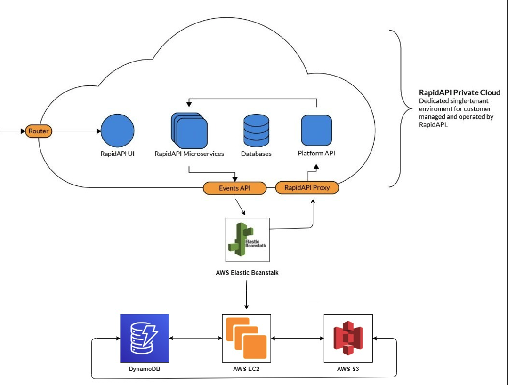

# Data Engineering

## Summary of Data Sources

**[RapidAPI](https://rapidapi.com/)**

* RapidAPI, the world's largest API hub, is used by over three million developers to find, test, and connect to thousands of APIs - all with a single API key and dashboard. 
* It's easy to use RapidAPI to consume APIs in your application. With RapidAPI, you can consume any API using a unified format that is easy to understand and embed in your application.
* We are using RapidAPI, so we can fetch data of houses which are available for sell or rent across the world.

## Data Pipelines

**Ingestion of Rapid API Data**

### TODO: CURRENT State Architecture

### FUTURE State Architecture 

